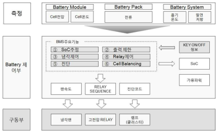
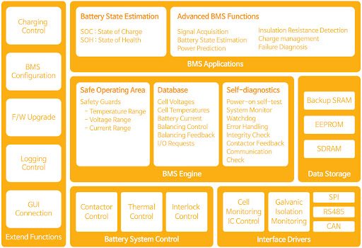

# 배터리 관리 시스템 설계 | Design BMS

- [FW](#fw)
    - [BMS FW 구성 및 세부 기능 | BMS FW Components & Functions](#bms-fw-구성-및-세부-기능--bms-fw-components--functions)
    - [BMS FW 구조 | Constructure of BMS FW](#bms-fw-구조--constructure-of-bms-fw)
        - [드라이버 | Driver](#드라이버--driver)
        - [모듈 | Module](#모듈--module)
        - [엔진 | Engine](#엔진--engine)
    - [일반 FW와의 차이점 | Difference with normal FW](#일반-fw와의-차이점--difference-with-normal-fw)

## FW
### BMS FW 구성 및 세부 기능 | BMS FW Components & Functions
- BMS HW, SW 사이의 인터페이스를 제공하는 하위 레벨 SW BMS FW is a low-level software that provides an interface between BMS hardware (HW) and software (SW).
- BMS 보드 중 메모리(`EEPROM) 내에 내장되어 있으며, 프로그래밍을 통해 CR 가능 It is embedded within the BMS board's memory (EEPROM) and can be programmed for Create & Read (CR).
- BMS 구동에 필요한 시스템은 비휘발성 메모리인 EEPROM에 저장, 시스템이 재시작해도 기존 정보 기억함 Essential system data for BMS operation is stored in the non-volatile EEPROM memory, preserving information even when the system restarts.

`CR만 평소에 하고 주기적으로 D를 수행하거나 누적량에 따라 D를 수행해서 메모리 성능 지키기 필요`

`Routine Calibration (CR) and periodic or accumulated data (D) operations are necessary to maintain memory performance.`

### BMS FW 구조 | Constructure of BMS FW

#### `드라이버 | Driver`
기능(Function) : `초기화 (RESET / Initialization)`

HW장치(LCD, Memory, IC) - MCU 연동 위해 드라이버를 내부 펌웨어에 적용 (Analog [V] → IC Driver(Monitoring) → Connect Driver → MCU → LCD Driver)   Drivers are integrated into the internal firmware to interact with hardware devices such as LCD, Memory, and ICs.

- 통신 드라이버 Communication Drivers
- 네트워크 드라이버 Network Drivers
- 입출력 드라이버 Input/Output Drivers
- 메모리 드라이버 Memory Drivers

They manage the interface between the hardware (Analog [V] → IC Driver (Monitoring) → Connect Driver → MCU → LCD Driver) and the firmware.

#### `모듈 | Module`
기능(Function) : `구동 (RUN / Operation)`

독립적 목적 가지고 움직이는 프로그램들의 집합 계층  Modules are collections of programs with independent purposes that operate at a specific layer.

드라이버가 필요한 장치의 경우 모듈이 드라이버 경유해 장치에 접근 후 제어하고, 아닐 경우 직접 접근 후 제어한다.  Modules access and control devices either directly or through drivers if needed.

- 신호 모듈 Signal Module
- 릴레이 제어 모듈 Relay Control Module
- 절연 모듈 Isolation Module
- 센싱 모듈 Sensing Module

#### `엔진 | Engine`
기능(Function) : `소프트웨어 링크 (Link SW)`
OS 혹은 FW와 SW의 링크

FW의 가장 상위 / SW의 가장 하위 개념 (HW → FW → Engine → SW)  The Engine is the highest layer of the firmware and the lowest layer of software

BMS 알고리즘 소프트웨어 구동 시 가장 근본적이고 본질적인 기능 수행함.  It serves as a critical link between the OS or firmware and software, executing fundamental functions essential for running BMS algorithms.

- 데이터 베이스 엔진 Database Engine
- 진단 엔진 Diagnostic Engine
- 시스템 엔진 System Engine
- 메모리 관리 엔진 Memory Management Engine

### 일반 FW와의 차이점 | Difference with normal FW
`일반 펌웨어`는 장치의 전반적인 작동을 제어하고, 다양한 기능을 지원하는 반면, `BMS 펌웨어`는 배터리의 수명과 안전을 보장하기 위해 상태와 안전을 관리하는 데 특화

`Normal firmware` controls the overall operation of the device and supports various functions, while `BMS firmware` is specialized in managing the battery's state and safety to ensure its lifespan and safety.
