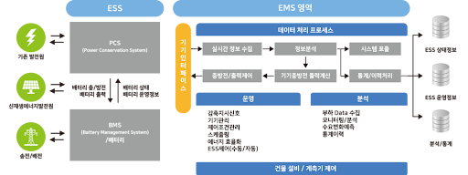

# Energy Storage System | 에너지 저장 시스템

스마트 그리드의 구성체계로서 태양광 발전을 포함한 신재생 에너지를 활성화 함에 있어 전력 소비 주체도 전력 생산자의 역할을 가능케 하는 전력 저장 기술

생산된 전력을 저장해 두었다가 필요한 시기에 공급받도록 돕는 장치

#### 기능
- 데이터처리 프로세스
- 운영
- 분석
- 건물 계측기 제어
- 운영관리

#### 그림 출처
[woorizen - ESS-EMS](http://www.woorizen.com/ko/Energy/ESS-EMS.aspx)
