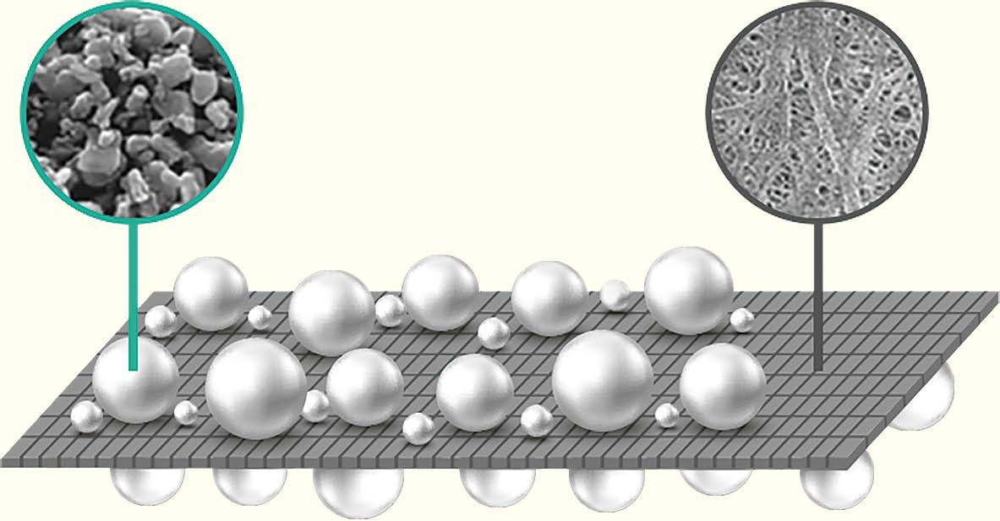

# Safety Reinforced Separator | 안전성 강화 분리막

@LG Energy Solution

분리막 표면에 세라믹 입자와 고분자 바인더를 코팅하는 기술

기존 : 100°C에서 내구도 떨어지지만 
SRS : 200°C에도 견딜 수 있음

→ 에너지 밀도와 출력 높은 하이니켈 배터리에 적용할 때도 안전하고 높은 성능 유지 가능

#### 사진 출처
ENSOLPEDIA_2023
