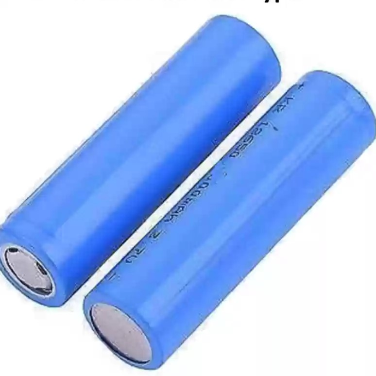

# 배터리 | Battery

## 배터리의 단위 | Battery Unit

|단위(Unit)|설명(Description)|구성(Structure)|전압(Voltage)[V]|
|---|---|---|---|
|셀(Cell) |배터리의 가장 작은 단위 Smallest Unit of a Battery||1.2 ~ 4.2|
|모듈(Module) |여러 셀을 직/병렬 연결한 구조, 배터리 팩의 중간 단계 A structure combining multiple cells in series/parallel, an intermediate unit of a battery pack|셀(Cell), 배터리 커넥터(Battery Connectors), 배터리 관리 시스템(BMS), 케이스(Casing)|
|블록(Block) |||
|배터리(Battery) |||
|팩(Pack) |모듈의 통합 단위 an integral unit assembled from multiple battery modules|배터리 모듈들(Severla Battery Modules), 배터리 커넥터(Battery Connectors), 냉각 시스템(Cooling System), 전기적 인터페이스(Electrical Interface), 케이스(Casing)||
|유닛(Unit) |||
