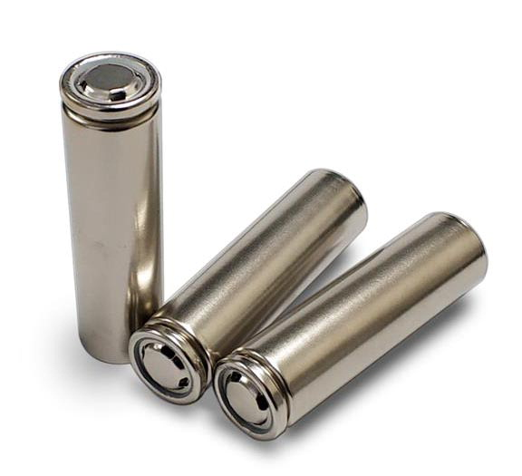
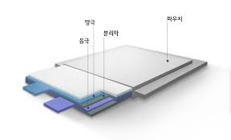
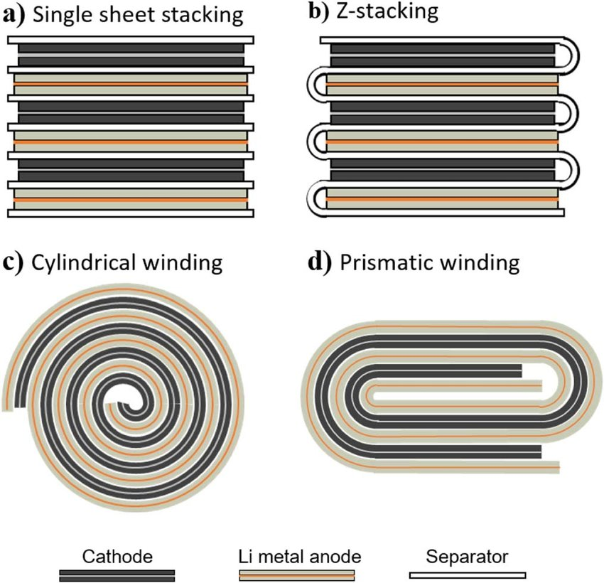
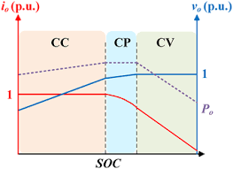

# 배터리 | Battery

- [배터리 | Battery](#배터리--battery)
  - [배터리의 단위 | Battery Unit](#배터리의-단위--battery-unit)
  - [1차 전지, 2차 전지 | Primary Cell, Secondary Cell](#1차-전지-2차-전지--primary-cell-secondary-cell)
  - [리튬이온 전지 | Li-Ion Cell](#리튬이온-전지--li-ion-cell)
    - [리튬이온 전지형태별 종류 | Li-Ion Types](#리튬이온-전지형태별-종류--li-ion-types)
    - [Jelly Roll - Stacking vs Winding](#jelly-roll---stacking-vs-winding)
    - [리튬이온 전지 구조 | Li-Ion Cell Structure](#리튬이온-전지-구조--li-ion-cell-structure)
    - [방전 과정 | Discharge Process](#방전-과정--discharge-process)
      - [이온과 전자의 이동 | Ion and Electron Movement](#이온과-전자의-이동--ion-and-electron-movement)
      - [리튬이온 전지의 충방전 | Li-ION Cell Charge/Discharge](#리튬이온-전지의-충방전--li-ion-cell-chargedischarge)
      - [분극 현상 | Polarization](#분극-현상--polarization)
  - [참고자료 | Reference](#참고자료--reference)

## 배터리의 단위 | Battery Unit

|단위(Unit)|설명(Description)|구성(Structure)|전압(Voltage)[V]|
|---|---|---|---|
|셀(Cell)|배터리의 가장 작은 단위 Smallest Unit of a Battery||1.2 ~ 4.2|
|모듈(Module) |여러 셀을 직/병렬 연결한 구조, 배터리 팩의 중간 단계 A structure combining multiple cells in series/parallel, an intermediate unit of a battery pack|셀(Cell), 배터리 커넥터(Battery Connectors), 배터리 관리 시스템(BMS), 케이스(Casing)|
|팩(Pack) |모듈의 통합 단위 an integral unit assembled from multiple battery modules|배터리 모듈들(Severla Battery Modules), 배터리 커넥터(Battery Connectors), 냉각 시스템(Cooling System), 전기적 인터페이스(Electrical Interface), 케이스(Casing)||
* cell to Pack이라고 모듈을 만들지 않고 바로 팩으로 만들기도 함

## 1차 전지, 2차 전지 | Primary Cell, Secondary Cell

|1차 전지(Primary Cell)|2차 전지(Secondary Cell)|
|---|---|
|방전(discharge)|충방전(charge/discharge)|
|망간(Mn)건전지, 알칼리(Alkali)건전지|리튬이온(Li-Ion), 리튬폴리머(Lithium Polymer), 니켈카드전지(Nickel-cadmium), 니켈수소전지(Nickel-hydrogen) 등|

* `메모리 효과(Memory Effect)` : (주로 니켈류) 전지의 용량이 남아있는 상태에서 충전을 하게 되면 남아있던 전지의 용량을 사용하지 못하게 되는 현상 -> 방전 후 충전을 시키면 다시 전부 사용 가능해짐

* `스웰링 현상/배부름 현상(Swelling Phenomenon/Fullness Phenomenon)` : (주로 리튬이온류)배터리의 전해액이 산화하며 발생하는 가스로 인해 배터리 내부에 가스가 차는 현상

## 리튬이온 전지 | Li-Ion Cell
### 리튬이온 전지형태별 종류 | Li-Ion Types
|구분|특징|
|---|---|
|원통형(Cylindrical Type) |- 원통형 스틸 캔 케이스 - 크기 작음 - 전통적 형태로 규격화된 사이즈
|장점|- 가격 저렴 - 대량 생산 용이 - 부피당 에너지 밀도 높음|
|단점|- 전기차 배터리 시스템 구축 시 고비용 - 낮은 에너지 밀도 - 짧은 수명|
|==========|==========|
|각형(Square Type) |- 알루미늄 캔 케이스 - 여러개 쌓기 가능|
|장점|- 외부 충격에 강함 |
|단점|- 내부 공간 활용 측면에서 불리 - 제조 공정이 상대적으로 복잡함 - 형태변경 어려움 - 무거움|
|==========|==========|
|파우치형(Pouch Type) |- 부드러운 필름으로 포장 - 내부 공간 꽉 참 - 얇음
|장점|- 공간 효율 좋아 에너지 밀도 높음 - 다양한 배터리 디자인 가능|
|단점|- 다른 형태에 비해 케이스가 단단하지 않아 모듈이나 팩 제작시 커버 필요 - 낮은 생산성 - 내구성 약함|

### Jelly Roll - Stacking vs Winding

- 원형 : Jelly Roll 그대로
- 각형 & 파우치형 : Jelly Roll 압착 후 casing 하거나 stack

=> Winding방식 후 압착한 경우 양 옆에 열이 나서 C-rate가 중요함!
 압착하지 않은 경우(주로 원통형) 저항이 일정함

* 리튬의 전착 (Electroplating) : 음극의 대면이 양극보다 큼! 아닐 경우 충전시 양극에서 빠져나운 리튬이 음극의 모서리에서 석출됨

### 리튬이온 전지 구조 | Li-Ion Cell Structure

|구성 요소|역할|소재|
|---|---|--|
|양극(Cathode)|외부 導線으로부터 전자를 받아 양극 활물질 이 환원되는 전극 The positive or oxidizing electrode that acquires electrons from the external circuit and is reduced during the electrochemical reaction|알루미늄(Aluminium)|
|음극(Anode)|음극 활물질(흑연, Carbon)이 산화되면서 導線으로 전자를 방출하는 전극 The negative or reducing electrode that releases electrons to the external circuit and oxidizes during the electrochemical reaction|구리(Copper)|
|분리막(Seperator)|양극과 음극의 전기적 접촉을 막는 다공성 막 A porous membrane that prevents electrical contact between the cathode and anode|폴리에틸렌 (Polyethylene) / 폴리프로필렌 (Polypropylene)|
|전해질(Electrolyte)|양극과 음극간의 이온 이동을 가능케 하는 중간 매개체 A medium that enables ion movement between the anode and cathode|Liquid, Gel, Solid 형태의 화합물|
|케이스(Case)|셀 보호 Protect Cell|Metal Can, Aluminium Pouch|

### 방전 과정 | Discharge Process

- **`양극 (Cathode)`**

  : 양극은 외부 전선으로부터 전자를 받아 양극 활물질이 환원되는 전극입니다. 방전 시, 양극에서 환원 반응이 일어나면서 전자가 외부 회로를 통해 음극으로 이동합니다. 양극의 소재로는 일반적으로 알루미늄이 사용됩니다.
  
  : The cathode acquires electrons from the external circuit and is reduced during the electrochemical reaction. During discharge, reduction reactions occur at the cathode, and electrons move through the external circuit to the anode. The cathode is typically made of aluminium.

- **`음극 (Anode)`**

  : 음극은 전자를 방출하며 산화 반응이 일어나는 전극입니다. 방전 과정에서 음극의 활물질(흑연, Carbon 등)이 산화되면서 전자를 외부 회로로 방출합니다. 음극의 소재로는 주로 구리가 사용됩니다.

  : The anode releases electrons and undergoes oxidation. During discharge, the active material in the anode (such as graphite or carbon) oxidizes, releasing electrons to the external circuit. The anode is typically made of copper.

- **`분리막 (Separator)`**

  : 양극과 음극 사이에 위치하여 전기적 접촉을 막는 다공성 막입니다. 이는 전극 간의 직접적인 접촉을 방지하여 단락을 방지합니다. 분리막은 폴리에틸렌(PE) 또는 폴리프로필렌(PP)으로 만들어집니다.

  : The separator is a porous membrane that prevents electrical contact between the anode and cathode. It prevents direct contact between electrodes and avoids short-circuits. The separator is made of polyethylene (PE) or polypropylene (PP).

- **`전해질 (Electrolyte)`**

  : 양극과 음극 사이에서 이온의 이동을 가능하게 하는 중간 매개체로, 액체, 겔, 또는 고체 형태로 존재합니다. 전해질은 전기화학 반응을 지원하며 이온 전도성을 제공합니다.

  : The electrolyte is the medium that allows ion movement between the anode and cathode. It can be in liquid, gel, or solid form. The electrolyte facilitates electrochemical reactions and provides ionic conductivity.

- **`케이스 (Case)`**

  : 배터리 셀을 물리적으로 보호하고 외부 환경으로부터 방지하는 역할을 합니다. 케이스는 금속 캔 또는 알루미늄 파우치로 만들어집니다.

  : The case protects the battery cell physically and shields it from external conditions. The case is made from materials like metal cans or aluminium pouches.

#### 이온과 전자의 이동 | Ion and Electron Movement

- 방전 시 이온은 음극에서 양극으로 이동하며, 이는 전해질을 통해 이루어집니다.
- Discharge involves the movement of ions from the anode to the cathode through the electrolyte.
- 전자는 외부 회로를 통해 양극에서 음극으로 이동하며, 이로 인해 전기 에너지가 공급됩니다.

**Electrons move from the cathode to the anode through the external circuit, generating electric power.**

#### 리튬이온 전지의 충방전 | Li-ION Cell Charge/Discharge

- **`CC (Constant Current)`** 

  : 전류가 일정, 방전에 많이 사용, SOC 100%까지 충전하기는 어려움(분극현상)
  
  : Cosntant Current, usually in Discharge, hard to charge 'till SOC 100%

- **`CV (Constant Voltage)`** 

  : 전압이 일정, 충전에 많이 사용
  
  : Cosntant Voltage, usually in Charge
- **`CC-CV`** 

  : CC → CV, Cell에서 충전 많이 함(최대용량까지 충전 가능)

  : CC → CV, Charge for cell (available to charge 'till SOC 100%)

- **`CP (Constant Power)`** 

  : Constant of (Current * Voltage), sys.단위에 많이 사용 (난로 등 열내는 기기에서 충반전시 CP 많이 택함)

  : Constant of (Current * Voltage), usually for sys (especially charge/discharge for heating machines)

#### 분극 현상 | Polarization

이차 전지를 충전 또는 방전할 때의 전압(CCV)이 개방회로에서 측정한 전압(Open Circuit Voltage, OCV)보다 낮거나 높게 나오는 현상 When charging or discharging a secondary battery, the voltage (CCV) may appear lower or higher than the open circuit voltage (OCV) measured under no load conditions.

원인 : 전지 내부의 저항, 전지 내 리튬이온 확산 속도에 따른 부위별 농도 차이 등 Cause: This discrepancy can be attributed to internal resistance of the battery and differences in concentration within the battery due to the rate of lithium-ion diffusion.

`OCV외에도 충방전 전압 확인해야 실 사용량 / 충방전량 알 수 있음` `Aside from OCV, it is also necessary to monitor the charging and discharging voltages to accurately determine the actual usage and charge/discharge amounts.`

## 참고자료 | Reference
- [Davide Andrea. 『Battery Management Systems for Large Lithium-Ion Battery Packs』. Artech,2010](https://ieeexplore.ieee.org/document/9100544)
- [배터리인사이드|BATTERY INSIDE](https://inside.lgensol.com/en/category/tech-en/)
- [ENSOLPEDIA_2023](https://inside.lgensol.com/wp-content/themes/twentytwenty/e-book/ecatalog5.html)
- ["각형, 원통형, 파우치형… 형태에 따른 전기차 배터리 특성", SK이노베이션뉴스룸, 2021.06.17 수정, 2024.08.14접속, https://skinnonews.com/archives/84588](https://skinnonews.com/archives/84588)
