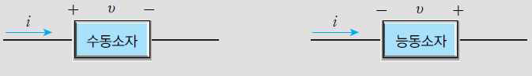
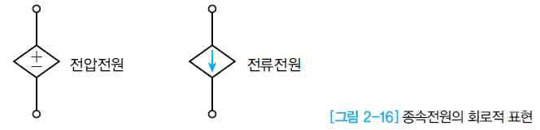

# 회로 | Circuit

- [용어 | Terminology](#용어--terminology)
- [소자 | Element](#소자--element)
- [전원 | Source](#전원--source)
- [전압 | Voltage](#전압--voltage)
  - [옴의 법칙 | Ohm's Law](#옴의-법칙--ohms-law)
- [회로 해석 | Circuit Analysis](#회로-해석--circuit-analysis)
  - [회로해석을 위한 기본단위 | Fundamental Units in Circuit Analysis and Design](#회로해석을-위한-기본단위--fundamental-units-in-circuit-analysis-and-design)

## 용어 | Terminology

| 용어(Terminology) | 설명(Description) | 기호(Symbol) | 단위(Unit) | 공식(Formula) |
|---|---|---|---|---|
| 전하(Charge) | 양성자는 [+] 전하를 띠고, 전자는 [-] 전하를 띠며, 중성자는 전하를 가지지 않음. 자유전자는 전류를 흐르게 해줌<br>Protons carry a [+] charge, electrons carry a [-] charge, and neutrons have no charge. Free electrons enable the flow of current. | Q | [C]coulomb |  |
| 전류(Current) | 전하의 흐름. 전자의 이동을 통해 전기가 흐름<br>Flow of charge. Electricity flows through the movement of electrons. | I | [A]ampere | `I = Q / t` |
| 직류(DC: Direct Current) | 전류의 방향과 크기가 시간에 따라 변하지 않는 전류<br>Current whose direction and magnitude remain constant over time. | I | [A]ampere |  |
| 교류(AC: Alternating Current) | 전류의 방향과 크기가 주기적으로 변하는 전류<br>Current whose direction and magnitude vary periodically. | i | [A]ampere | `i(t) = I_max * sin(ωt)` |
| 전압(Voltage) | 단위 전하량에 의해 변환된 위치 에너지<br>Energy per unit charge converted from position energy. | V | [V]volt | `V = W / Q` |
| 저항(Resistance) | 전류의 흐름에 저항을 가하는 물질의 성질<br>Property of a material that resists the flow of current. | R | [Ω]ohm | `R = V / I` |
| 전도(Conductance) | 전류의 흐름을 용이하게 하는 물질의 성질<br>Property of a material that facilitates the flow of current. | G | [S]siemens (또는 mho) | `G = 1 / R` |
| 전력(Power) | 단위 시간당 소비되는 에너지의 양<br>Amount of energy consumed per unit time. | P | [W]watt | `P = V * I` 또는 `P = I^2 * R` 또는 `P = V^2 / R` |

## 소자 | Element


- **수동 소자 | Passive Element**  
  : 전압을 낮춤  
  : Reduces voltage  
  예) 저항(R), 인덕터(L), 커패시터(C)  
  ex) Resistor (R), Inductor (L), Capacitor (C)
  ```
  - 인덕터(Inductor) : 전자기장을 이용한 전자부품, 과도전류의 변화를 이용해서 전압의 변화를 유도해내는 전자부품

  - 커패시터(Capacitor) : 전자회로에서 전기를 일시적으로 저장하는 장치
    축전기 혹은 콘덴서(Condenser)라고도 부름
  ```
  => 인덕터 : **전압**의 변화에 저항  
  => 커패시터 : **전류**의 변화에 저항  
  하여 급격한 변화를 막아주는 역할을 함.

---
- **능동 소자 | Active Element**  
  : 전압을 공급  
  : Supplies voltage  
  예) 건전지  
  ex) Battery

---
- **저항 소자 | Resistor**  


## 전원 | Source

- **독립 전원 | Independent Source**  
  : 다른 소자의 에너지 값에 상관없이 그 자체가 가지고 있는 에너지를 직접 혹은 독립적으로 공급하는 전원  
  : A power source that provides energy directly or independently, regardless of other elements' energy values  
  예) 건전지  
  ex) Battery
  

---

- **종속 전원 | Dependent Source**  
  : 다른 소자의 상태에 따라 그 전압이나 전류의 값을 조정하여 에너지를 공급하는 전원  
  : A power source that supplies energy by adjusting its voltage or current based on the state of other elements  
  예) 전압 제어 전압원 (VCVS), 전류 제어 전압원 (CCVS)  
  ex) Voltage-controlled voltage source (VCVS), Current-controlled voltage source (CCVS)
  
  

## 전압 | Voltage
접지 연결 상태에 따라 분류

- **접지 전압 | Grounded Voltage**  
  : 접지에 직접 연결되어 있는 전압으로, 접지지점의 전압 값을 0으로 했을 때의 상대적인 단자 전압 값  
  : Voltage directly connected to ground, relative to the voltage at the ground point when its value is considered as 0.  
  예) 가정용 전원, 계측기 전원  
  ex) Household power, instrument power

----

- **부유 전압 | Floating Voltage**  
  : 직접 접지에 연결되어 있지 않은 전압   
  : Voltage not directly connected to ground.
  예) 건전지  
  ex) Battery

### 옴의 법칙 | Ohm's Law
- 직류 및 실효치 (DC & RMS: Root Mean Square) : V = IR
- 교류 (AC) : v = iR

## 회로 해석 | Circuit Analysis

### 회로해석을 위한 기본단위 | Fundamental Units in Circuit Analysis and Design

- **노드(Node)**  
  : 여러 개의 소자가 만나는 지점  
  : Point connected with several Elements

- **폐루프(Closed Loop)**  
  : 여러 개의 소자가 연결되어 하나의 닫힌 고리를 만드는 것  
  : Path formed by interconnected components creating a closed loop

- **메시(Mesh)**  
  : 폐루프 중에서 그 루프 안에 또 다른 폐루프가 없는 가장 작은 단위 
  : The smallest closed loop in a circuit where no other loops exist within it
